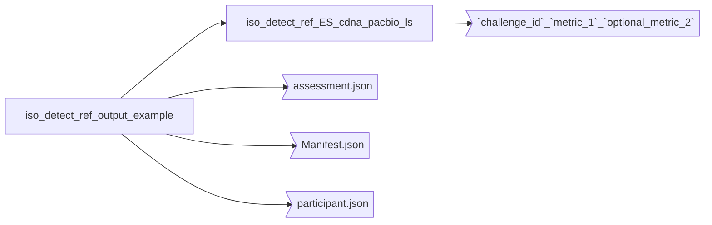

# Example data (Input/Output) from LRGASP challenge 1 pipeline

In this folder, you will find an example for the execution of this pipeline for a tool. For confidentiality reasons,
the names in the "entry.json" and "experiments.json" have been changed.

The input for this pipeline is a folder path (Multiple files are needed), but only 4 files are needed from a user perspective;
the rest can be downloaded depending on the organism that you used.

The example showcased in the main README of the repo for running `pipeline.bash` points out to this folder.
## Input

### User-generated input
- `models.gtf`: GTF file with model annotations. More information on the format in the [LRGASP GTF format documentation](https://lrgasp.github.io/lrgasp-submissions/docs/model-format.html)
- `entry.json`: Information about the entry and the team submitting it. More details: [LRGASP metadata documentation](https://lrgasp.github.io/lrgasp-submissions/docs/metadata.html)
- `experiment.json`: This file describes the experiment, specifying all data file. More details: [LRGASP metadata documentation](https://lrgasp.github.io/lrgasp-submissions/docs/metadata.html).
   Please take into consideration that the path limitation is not in order here and was just required for the challenge.
- `SJ.out.tab`: Splice Junction file created by STAR. Info on how to generate in [LRGASP challenge 1 evaluation repository](https://github.com/LRGASP/lrgasp-challenge-1-evaluation#run-sqanti3).
   More info on the actual file format can be found in this [Illumina support page](https://support.illumina.com/content/dam/illumina-support/help/Illumina_DRAGEN_Bio_IT_Platform_v3_7_1000000141465/Content/SW/Informatics/Dragen/TPipelineSJ_fDG.htm)
- `read_model_map.tsv`: Read to transcript model map. More information on this file in [LRGASP Read to transcript model map format](https://lrgasp.github.io/lrgasp-submissions/docs/read_model_map_format.html)

### Downloadable files
- `mouse.refTSS_v3.1.mm39.bed`: CAGE-Peak file. More info and download details on [LRGASP challenge 1 evaluation repository](https://github.com/LRGASP/lrgasp-challenge-1-evaluation#run-sqanti3)
- `polyA_list.txt`: polyA motif list, a TXT file with the most common polyA motifs for human and mouse. More info and download details on [LRGASP challenge 1 evaluation repository](https://github.com/LRGASP/lrgasp-challenge-1-evaluation#run-sqanti3)
- `lrgasp_grcm39_sirvs.fasta`: Transcriptome references, organism-specific, contains SIRV data, consisting of both ERCCs and SIRVs. More details and download links in: [LRGASP Transcriptome references](https://lrgasp.github.io/lrgasp-submissions/docs/reference-genomes.html#transcriptome-references)
- `lrgasp_gencode_vM28_sirvs.mouse.gtf`: Genome references, organism-specific, contains SIRV data, consisting of both ERCCs and SIRVs. More details and download links in: [LRGASP Genome references](https://lrgasp.github.io/lrgasp-submissions/docs/reference-genomes.html#genome-references)

**IMPORTANT**:
- Please download the reference genome and transcriptome following the instructions [here](https://lrgasp.github.io/lrgasp-submissions/docs/reference-genomes.html)
and place them in the `iso_detect_ref_input_example` folder before trying to run the pipeline. Those 2 files are big (842MB and 2.6 GB), so they have been excluded from the repository.
- Please decompress with `gzip -d` the `models.gtf.gz` and `read_model_map.tsv.gz`.

Please note that some of the references are updated from when the documentation was written: the updated references can be found in [synapse](https://www.synapse.org/#!Synapse:syn25683363)

More general information about how submissions are structured in the [Submission structure documentation](https://lrgasp.github.io/lrgasp-submissions/docs/submission.html).
Please note that the directory hierarchy was designed for the purpose of the challenge and is not strictly followed here, although the files listed are still required.

### Output

The output is as expected for running the pipeline for 1 example dataset. How the files are structured:

The individual files within the `iso_detect_ref_ES_cdna_pacbio_ls` folder contain each of the metrics. These have been
separated as indicated in the [LRGASP challenge 1benchmarking workflow repository](https://github.com/ESapenaVentura/lrgasp_benchmarking_workflow)

If there were multiple challenges associated with this submission, e.g. using the WTC11 sample instead of the ES cells, 
there would be as many folders as challenges.